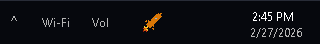
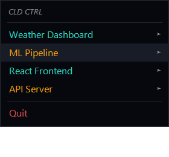
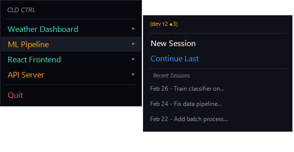

# CLD CTRL

<p align="center">
  
  <br>
  <strong>Mission control for Claude Code</strong>
</p>

A project launcher and management tool for [Claude Code](https://docs.anthropic.com/en/docs/claude-code). Available as a **Windows system tray app** (PowerShell) and a **cross-platform CLI/TUI** (Node.js).

## Screenshots

### PowerShell Tray App (Windows)

<p align="center">
  
  <br>
  <em>CLD CTRL in the system tray</em>
</p>

<p align="center">
  
  &nbsp;&nbsp;
  
  <br>
  <em>Git status at a glance · session history per project</em>
</p>

### CLI (cross-platform)

```
┌─ CLD CTRL ──────────────────────┬───────────────────────────────┐  v0.1.0
│ Projects /search                │ ML Pipeline                   │
│   Weather Dashboard  master     │ ~/projects/ml-pipeline        │
│ › ML Pipeline        dev ●3     │ dev ↑2 ●3 | ⚠ 5 issues       │
│   React Frontend     main       │                               │
│   API Server         main ●1    │ [n] New session  [c] Continue │
│                                 │ [i] Issues (5)                │
│                                 │                               │
│                                 │ Recent sessions:              │
│                                 │ › 2h ago  "Train classifier"  │
│                                 │   1d ago  "Fix data pipeline" │
│                                 │   3d ago  "Add batch process" │
└─────────────────────────────────┴───────────────────────────────┘
 Focus: projects | ? help · / filter · q quit
```

## Features

- **Project launcher** — open Explorer, VS Code, and a Claude Code terminal in one click/command
- **Git status** — branch, uncommitted changes, unpushed commits per project
- **Session management** — resume your last conversation or pick from recent sessions
- **GitHub issues** — see open issue counts per project (CLI, requires `gh`)
- **Usage stats** — daily token and message counts (CLI)
- **Background daemon** — desktop notifications for issues and usage (CLI)
- **System tray** — always one click away, auto-start on login (PowerShell)
- **Simple config** — shared JSON format between both versions

## Quick Start

### PowerShell (Windows system tray)

1. Clone the repo:
   ```
   git clone https://github.com/RyanSeanPhillips/cldctrl.git
   ```

2. Copy the example config and add your projects:
   ```
   cp config.example.json config.json
   ```

3. Run it:
   ```
   .\cldctrl.ps1
   ```
   Or double-click `install.bat` to add it to Windows startup.

4. Press **Ctrl+Up** to open the launcher from anywhere.

### CLI (any platform)

1. Install:
   ```
   cd packages/cli && npm install && npm link
   ```

2. Run:
   ```
   cldctrl
   ```

CLI commands: `cldctrl list`, `cldctrl launch <name>`, `cldctrl stats`, `cldctrl issues`, `cldctrl add <path>`, `cldctrl config show`.

## Configuration

Both versions share the same `config.json` schema:

| Field | Description |
|---|---|
| `projects[].name` | Display name in the menu |
| `projects[].path` | Absolute path to the project directory |
| `projects[].hotkey` | Optional keyboard shortcut (CLI) |
| `launch.explorer` | Open File Explorer at project path |
| `launch.vscode` | Open VS Code at project path |
| `launch.claude` | Open a terminal and start Claude Code |
| `icon_color` | Hex color for the tray icon (default: `#e87632`) |

## Requirements

- **PowerShell version**: Windows 10/11, PowerShell 5.1+
- **CLI version**: Node.js 18+, any OS
- [Claude Code](https://docs.anthropic.com/en/docs/claude-code) installed and available in PATH
- VS Code (optional — disable with `"vscode": false` in config)

## License

AGPL-3.0
