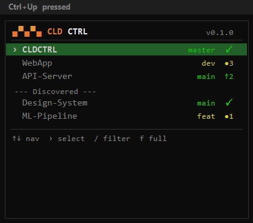
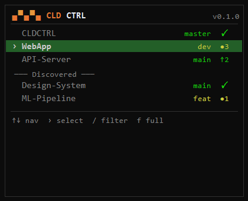
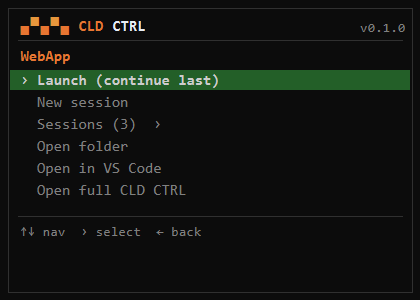

# CLD CTRL

<p align="center">
  
  <br>
  <strong>Mission control for Claude Code</strong>
</p>

A project launcher and management dashboard for [Claude Code](https://docs.anthropic.com/en/docs/claude-code). Instantly switch between projects, resume sessions, and launch new tasks — all from a single hotkey or terminal command.

<p align="center">
  
  <br>
  <em>Ctrl+Up &rarr; pick project &rarr; launch Claude Code in under 2 seconds</em>
</p>

## Install

```
npm i -g cldctrl
```

Requires Node.js 18+ and [Claude Code](https://docs.anthropic.com/en/docs/claude-code) installed.

### Enable Ctrl+Up hotkey (Windows)

```
cldctrl setup
```

This registers a global hotkey that opens a mini popup for instant project switching. Press **Ctrl+Up** from anywhere to launch.

## Screenshots

### Mini TUI Popup (Ctrl+Up)

The mini popup is a fast 3-phase wizard: pick a project, pick an action, go.

<p align="center">
  
  &nbsp;&nbsp;
  
  <br>
  <em>Project list with git status &nbsp;·&nbsp; Action menu for selected project</em>
</p>

### Full TUI (`cldctrl`)

The full dashboard with split-pane layout, session history, git status, and issue tracking.

<p align="center">
  
  <br>
  <em>Split-pane: project list + detail pane with sessions, issues, and git info</em>
</p>

### PowerShell System Tray (Windows)

Also available as a Windows system tray app with right-click menus.

<p align="center">
  
  <br>
  <em>CLD CTRL in the system tray</em>
</p>

<p align="center">
  
  &nbsp;&nbsp;
  
  <br>
  <em>Git status at a glance &nbsp;·&nbsp; session history per project</em>
</p>

## Features

- **Instant popup** — Ctrl+Up hotkey opens a mini TUI in ~300ms, pre-warmed for instant response
- **Project launcher** — open Explorer, VS Code, and Claude Code in one action
- **Session management** — resume your last conversation or pick from recent sessions
- **Git status** — branch, uncommitted changes, unpushed commits per project
- **GitHub issues** — see open issue counts, launch Claude Code with "fix issue" prompts
- **Auto-discovery** — finds projects from `~/.claude/projects` automatically
- **Usage stats** — daily token and message counts
- **Cross-platform TUI** — React/Ink terminal UI, runs on Windows, macOS, Linux
- **Two modes** — mini popup for quick launches, full dashboard for project management
- **Filter/search** — type `/` to fuzzy-filter projects in any view

## Usage

```bash
# Full TUI dashboard
cldctrl

# Mini popup (same as Ctrl+Up hotkey)
cldctrl --mini

# CLI commands
cldctrl list              # List all projects
cldctrl launch <name>     # Launch Claude Code for a project
cldctrl stats             # Show usage statistics
cldctrl issues            # Show GitHub issues across projects
cldctrl add <path>        # Add a project
cldctrl config show       # Show current configuration
cldctrl setup             # Set up Ctrl+Up hotkey (Windows)
```

Aliases: `cld` and `cc` also work (e.g. `cc --mini`).

## Keyboard Shortcuts

### Mini TUI (Ctrl+Up popup)

| Key | Action |
|-----|--------|
| `Up/Down` or `j/k` | Navigate list |
| `Right` or `Enter` | Drill in / execute |
| `Left` or `Esc` | Go back |
| `/` | Filter projects |
| `n` | New session with prompt |
| `f` | Expand to full TUI |
| `q` | Quit |

### Full TUI

| Key | Action |
|-----|--------|
| `Up/Down` or `j/k` | Navigate project list |
| `Tab` | Switch focus (projects / detail) |
| `n` | New Claude Code session |
| `c` | Continue last session |
| `i` | View issues |
| `/` | Filter projects |
| `?` | Help overlay |
| `q` | Quit |

## Configuration

CLD CTRL uses a shared `config.json`. Projects are auto-discovered from `~/.claude/projects` but can also be configured manually:

```json
{
  "config_version": 4,
  "projects": [
    { "name": "My Project", "path": "/path/to/project", "hotkey": "M" }
  ],
  "launch": { "explorer": true, "vscode": true, "claude": true },
  "notifications": {
    "github_issues": { "enabled": true, "poll_interval_minutes": 5 },
    "usage_stats": { "enabled": true, "show_tooltip": true }
  }
}
```

## Requirements

- **Node.js** 18+ (for `npm i -g cldctrl`)
- [Claude Code](https://docs.anthropic.com/en/docs/claude-code) installed and in PATH
- `gh` CLI (optional — for GitHub issue integration)
- VS Code (optional — disable with `"vscode": false` in config)
- **Ctrl+Up hotkey**: Windows 10/11 with Windows Terminal

## How It Works

CLD CTRL reads Claude Code's session data from `~/.claude/projects` to discover your projects and session history. It spawns Claude Code in new terminal windows with the right project path and optional session resume flags.

The mini TUI popup is pre-warmed at hotkey registration time so the first Ctrl+Up press is instant (~300ms). The full TUI runs a background daemon for git status polling, issue notifications, and usage tracking.

## Author

**Ryan Phillips** — [@RyanSeanPhillips](https://github.com/RyanSeanPhillips)

## License

[AGPL-3.0](LICENSE) — you can use CLD CTRL freely, but if you modify and distribute it (or run it as a service), you must open-source your changes under the same license.

Copyright 2025-2026 Ryan Phillips. All rights reserved.
