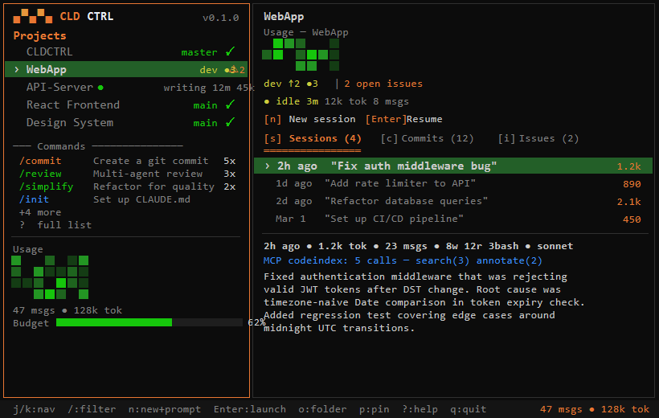

# CLD CTRL

<p align="center">
  <strong>Mission control for Claude Code</strong>
  <br>
  <a href="https://cld-ctrl.com">Website</a> · <a href="https://www.npmjs.com/package/cldctrl">npm</a> · <a href="https://github.com/RyanSeanPhillips/cldctrl/issues">Issues</a>
  <br><br>
  <a href="https://www.npmjs.com/package/cldctrl"></a>
  <a href="https://github.com/RyanSeanPhillips/cldctrl"></a>
  <a href="LICENSE"></a>
</p>

A terminal dashboard and session manager for [Claude Code](https://docs.anthropic.com/en/docs/claude-code). Track sessions, monitor token usage and costs, manage projects, and launch Claude Code — all from one place. Zero config: auto-discovers your existing Claude Code history.

<p align="center">
  
  <br>
  <em>Split-pane dashboard: projects, sessions, git status, usage stats, calendar heatmap</em>
</p>

## Install

```
npm i -g cldctrl
```

Requires Node.js 18+ and [Claude Code](https://docs.anthropic.com/en/docs/claude-code) installed. Also works with `npx cldctrl`.

## Why CLD CTRL?

Claude Code doesn't have a dashboard. CLD CTRL fills the gap:

- **Session history** — See every conversation across every project with token counts, tool usage, cost estimates, and model info. Resume any session with one key.
- **Usage & rate limit tracking** — Rolling 5-hour and 7-day usage windows, rate limit tier detection, overage monitoring, and per-session cost estimates.
- **Zero config** — Auto-discovers projects from your Claude Code history. No manual setup — install and run.
- **Project launcher** — Open file explorer, VS Code, and Claude Code in one action. No more remembering project paths.
- **Git status** — Branch, uncommitted changes, unpushed commits, and behind count shown inline for every project.
- **GitHub issues** — See open issues per project. Launch Claude Code with "fix issue" prompts.
- **File browser** — Browse project files in the dashboard with .gitignore support and VS Code integration.
- **Cross-platform** — Windows, macOS, and Linux with platform-specific terminal detection.

## Screenshot

<p align="center">
  
</p>

## Usage

```bash
# Full TUI dashboard
cldctrl                   # or: cld

# CLI commands
cldctrl list              # List all projects with git status
cldctrl launch <name>     # Launch Claude Code for a project
cldctrl stats             # Show usage statistics
cldctrl issues            # Show GitHub issues across projects
cldctrl add <path>        # Add a project
cldctrl summarize         # Generate AI summaries for sessions
cldctrl setup             # Set up global hotkey
```

## Keyboard Shortcuts

### Navigation

| Key | Action |
|-----|--------|
| `j` / `k` | Navigate projects |
| `g` / `G` | Jump to top / bottom |
| `Ctrl+d` / `Ctrl+u` | Half-page scroll |
| `Tab` | Switch pane focus |
| `/` | Filter projects |
| `?` | Help overlay |

### Actions

| Key | Action |
|-----|--------|
| `n` | New Claude Code session |
| `c` | Continue last session |
| `o` | Open in file explorer |
| `p` | Pin / unpin project |
| `r` | Refresh projects |
| `S` | Scan for new projects |
| `,` | Settings |

## How It Works

CLD CTRL reads Claude Code's session data from `~/.claude/projects` to discover your projects and session history. It parses JSONL session files for token counts, tool usage, and model info. A background daemon polls for git status, GitHub issues, and usage data, caching results for instant startup.

On first run, a welcome wizard checks your environment (Claude Code, git, gh) and auto-discovers all your projects. No configuration needed.

## Requirements

- **Node.js** 18+
- [Claude Code](https://docs.anthropic.com/en/docs/claude-code) installed and in PATH
- `gh` CLI (optional — for GitHub issue integration)
- VS Code (optional — for project opening)

## Configuration

Projects are auto-discovered from `~/.claude/projects` and can also be configured manually. Config lives at `~/.config/cldctrl/config.json` (or `%APPDATA%\cldctrl\` on Windows).

```json
{
  "config_version": 4,
  "projects": [
    { "name": "My Project", "path": "/path/to/project" }
  ],
  "launch": { "explorer": true, "vscode": true, "claude": true },
  "daily_budget_tokens": 1000000,
  "notifications": {
    "github_issues": { "enabled": true, "poll_interval_minutes": 5 },
    "usage_stats": { "enabled": true }
  }
}
```

## Author

**Ryan Phillips** — [@RyanSeanPhillips](https://github.com/RyanSeanPhillips)

## License

[AGPL-3.0](LICENSE) — you can use CLD CTRL freely, but if you modify and distribute it (or run it as a service), you must open-source your changes under the same license.

Copyright 2025-2026 Ryan Phillips. All rights reserved.
